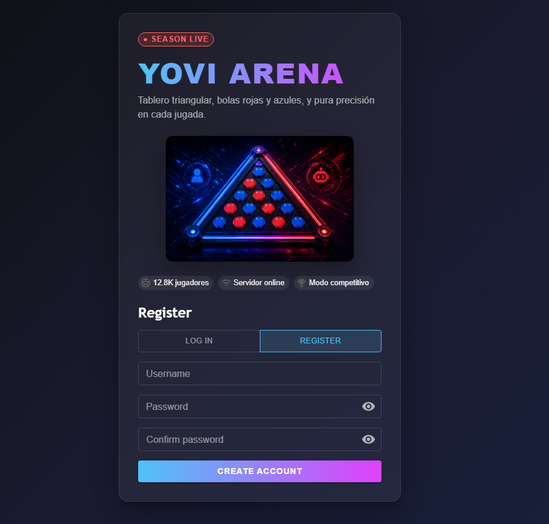
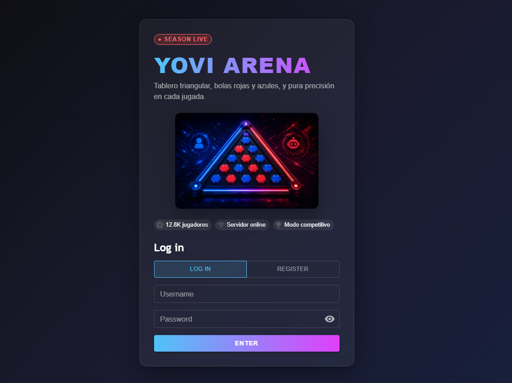
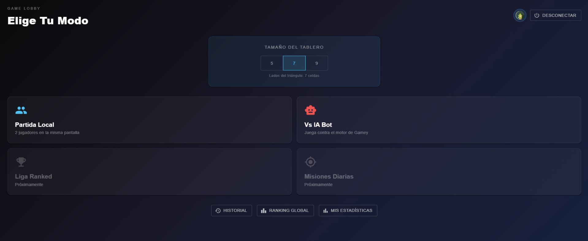
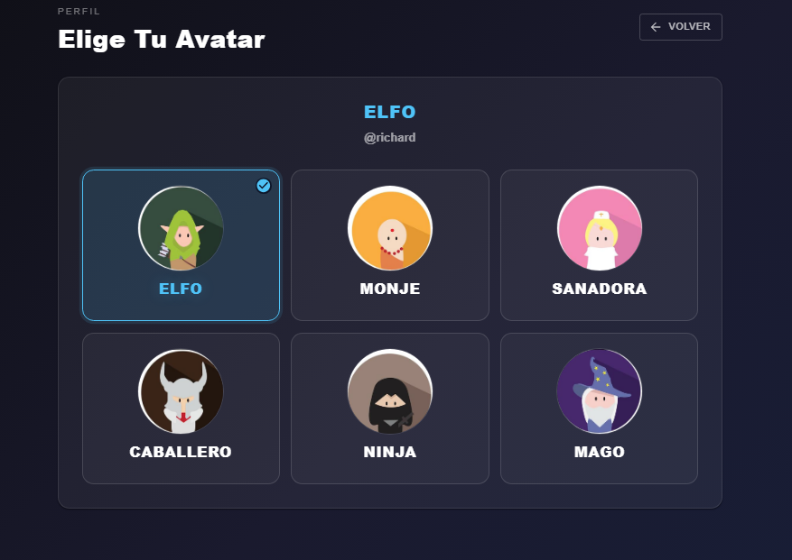
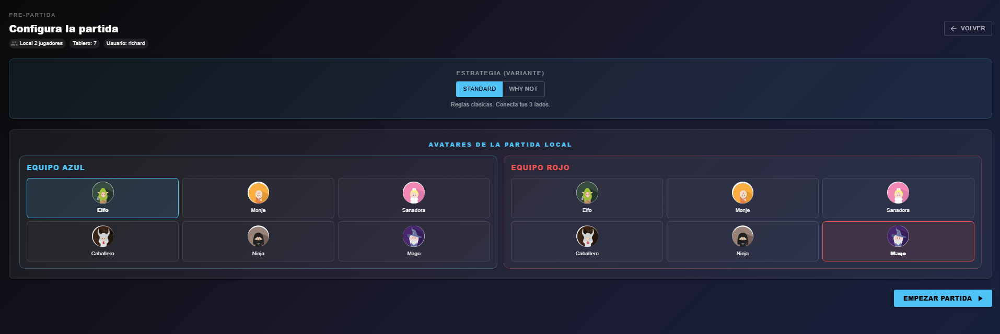
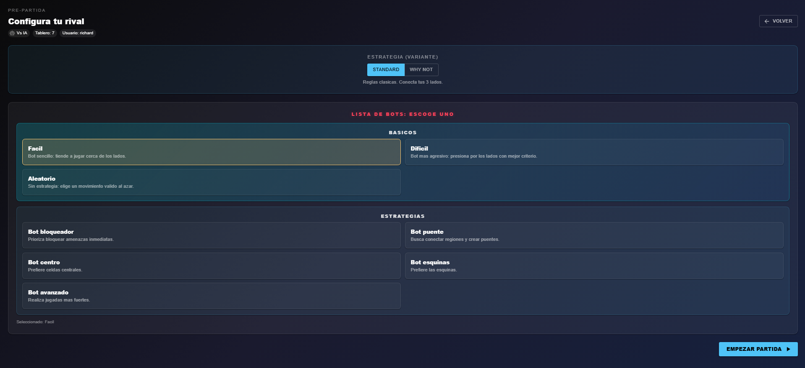
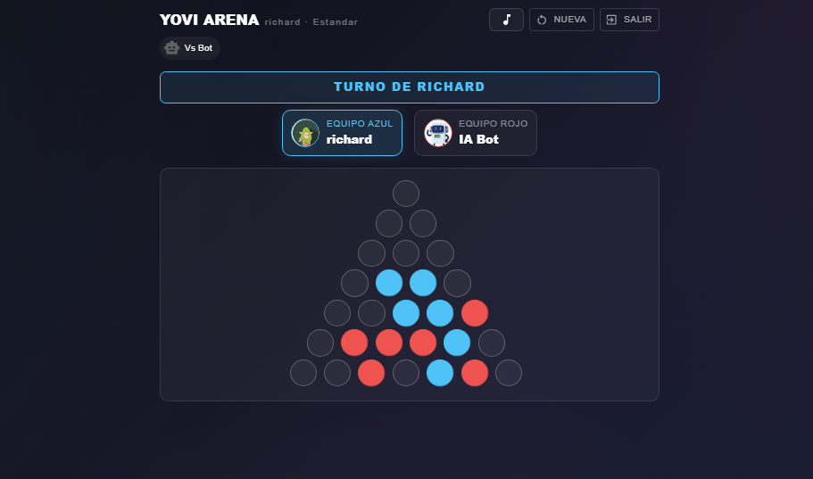
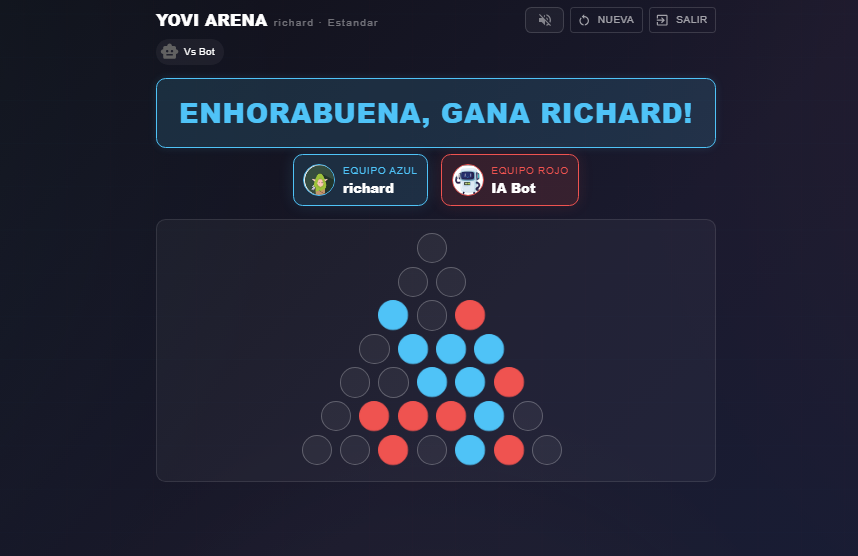

# Guía de uso: Cómo jugar a Yovi

## 1. Introducción

Yovi es una aplicación web que implementa el juego de estrategia *Y*, en el que dos jugadores compiten por conectar los tres lados de un tablero triangular.

Este documento describe el funcionamiento de la aplicación y el flujo completo para iniciar y jugar una partida.

---

## 2. Registro de usuario

Si el usuario no dispone de una cuenta, debe registrarse:

1. Seleccionar la pestaña **REGISTER**

2. Introducir:
   - Nombre de usuario
   - Contraseña
   - Confirmación de contraseña
   

3. Pulsar **CREATE ACCOUNT**

---

## 3. Inicio de sesión

Para acceder a la aplicación:

1. Seleccionar la pestaña **LOG IN**
2. Introducir:
   - Nombre de usuario
   - Contraseña
3. Pulsar **ENTER**

---

## 4. Menú principal

Una vez autenticado, el usuario accede al menú principal, desde donde puede:

- Iniciar una partida local
- Iniciar una partida contra la inteligencia artificial
- Seleccionar el tamaño del tablero
- Consultar el historial de partidas
- Acceder al ranking global
- Visualizar estadísticas personales
- Cerrar sesión

*(En la esquina superior derecha se encuentra el avatar del usuario. Desde este icono se puede acceder a opciones como la personalización del perfil y cerrar sesión.)*

---

## 5. Configuración del perfil

### 5.1 Selección de avatar

Durante la configuración de partida, cada jugador puede seleccionar un avatar representativo.

---

## 6. Configuración de la partida

### 6.1 Selección del tamaño del tablero

Antes de iniciar la partida, el usuario debe seleccionar el tamaño del tablero:

- 5: partidas rápidas
- 7: tamaño equilibrado (recomendado)
- 9: mayor complejidad estratégica

---

### 6.2 Selección del modo de juego

Desde el lobby principal:

El usuario puede elegir entre:

- **Partida local**: dos jugadores en el mismo dispositivo
- **Partida contra IA Bot**: juego contra un bot

Además, se puede acceder a opciones adicionales como historial, ranking y estadísticas.

---

## 7. Partida local

En este modo se configuran:

- Los avatares de ambos jugadores (equipo azul y equipo rojo)
- La variante del juego:
   - **STANDARD**: reglas clásicas
   - **WHY NOT**: variante alternativa(debes intentar que el rival gane)

---

## 8. Partida contra IA

En este modo se selecciona el comportamiento del rival automático:

### Dificultad o Estrategias disponibles:

- Fácil
- Difícil
- Aleatorio
- Bloqueador
- Centro
- Esquinas
- Puente
- Avanzado

---

## 9. Inicio de la partida

Una vez configurados todos los parámetros, el usuario debe pulsar **EMPEZAR PARTIDA** para iniciar el juego.

---

## 10. Desarrollo de la partida

### Elementos de la interfaz:

- Indicador de turno activo
- Identificación de los equipos (azul y rojo)
- Tablero triangular de juego

### Funcionamiento:

1. Los jugadores juegan por turnos
2. En cada turno se selecciona una casilla vacía
3. Se coloca una ficha en dicha posición
4. Las fichas no se pueden mover ni eliminar

En el modo contra IA, el sistema realiza automáticamente el movimiento del rival.

---
### 10.1 Control de sonido, nueva partida y salir
En la parte superior derecha la interfaz permite activar o desactivar la música del juego mediante el icono correspondiente en la barra superior.

Tambien permite reiniciar la partida o abandonar la partida actual.

---

## 11. Objetivo del juego

El objetivo consiste en conectar los tres lados del tablero mediante una cadena continua de fichas propias.

---

## 12. Fin de la partida

La partida finaliza automáticamente cuando uno de los jugadores consigue conectar los tres lados del tablero.

*(Imagen: pantalla de victoria)*

---

## 13. Consideraciones finales

- No es posible el empate; siempre existe un ganador
- El juego no incluye elementos aleatorios, por lo que la estrategia es determinante
- La elección del tamaño del tablero influye directamente en la duración y complejidad de la partida