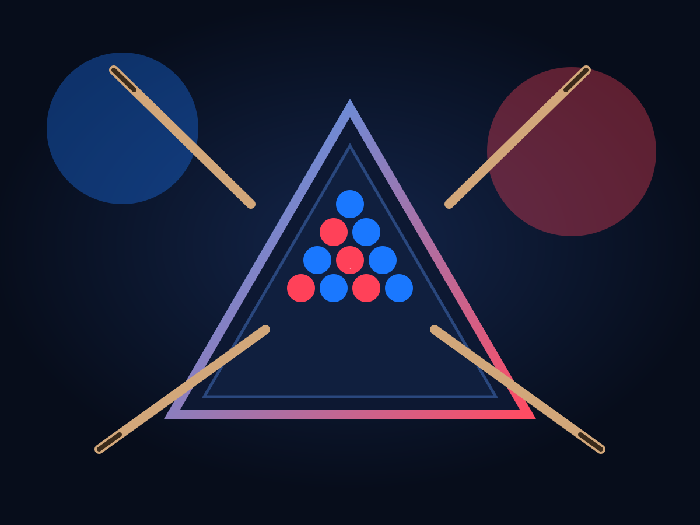

# Webapp - YOVI

<p align="center">
  
</p>

<p align="center">
  Frontend de la aplicacion YOVI, desarrollado con React, Vite y TypeScript.
  Proporciona la interfaz de usuario para jugar al juego Y, gestionar perfiles,
  consultar el historial de partidas, estadisticas personales y el ranking global.
</p>

## Que incluye este frontend

- **Interfaz de juego:** tablero interactivo para el juego Y con soporte para coordenadas baricentricas.
- **Jugadores y bots:** partidas locales contra otro jugador humano o contra un bot proporcionado por el servicio Gamey.
- **Gestion de usuarios:** formularios de registro e inicio de sesion integrados con el servicio `users`.
- **Historial y estadisticas:** visualizacion de partidas previas y rendimiento del jugador autenticado.
- **Ranking global:** tabla de mejores jugadores obtenida desde el servicio de usuarios.
- **Diseno moderno:** implementado con Material UI (MUI) para una experiencia de usuario fluida y responsiva.

## Requisitos

- [Node.js](https://nodejs.org/) (version 18 o superior)
- [npm](https://www.npmjs.com/)

Para usar todas las funcionalidades necesitas tener levantados los servicios:

- `users` en `http://localhost:3000`
- `gamey` en `http://localhost:4000`

Consulta el README de la raiz del repositorio para ver como arrancarlos.

## Puesta en marcha en local

Desde la carpeta `webapp`:

```bash
npm install
npm run dev
```

Por defecto el frontend queda disponible en:

```text
http://localhost:5173
```

Si quieres arrancar tambien el servicio de usuarios desde aqui puedes usar:

```bash
npm run start:all
```

Este script levanta el frontend (`npm run dev`) y el servicio `users` (via `npm run start:users`). El servicio `gamey` debe seguir arrancandose desde su propio modulo.

## Configuracion

El frontend se configura mediante variables de entorno de Vite:

- `VITE_API_URL`: URL base del servicio de usuarios (`users`).  
  Valor por defecto: `http://localhost:3000`.

- `VITE_GAMEY_URL`: URL base del servicio Gamey.  
  Valor por defecto: `http://localhost:4000`.

Puedes crear un fichero `.env.local` en esta carpeta para sobreescribirlas en desarrollo, por ejemplo:

```bash
VITE_API_URL=http://localhost:3001
VITE_GAMEY_URL=http://localhost:4001
```

## Testing

El proyecto utiliza una combinacion de pruebas unitarias, de integracion y de extremo a extremo (E2E).

### Pruebas unitarias e integracion (Vitest)

```bash
# Ejecutar todos los tests
npm test

# Ejecutar en modo watch
npm run test:watch

# Ejecutar tests con cobertura
npm run test:coverage
```

### Pruebas E2E (Cucumber + Playwright)

Las pruebas E2E verifican los flujos completos de usuario sobre el navegador.

```bash
# Instalar navegadores necesarios
npm run test:e2e:install-browsers

# Ejecutar pruebas E2E (levanta webapp y users si es necesario)
npm run test:e2e
```

El detalle de los escenarios E2E se encuentra bajo `test/e2e`.

## Scripts disponibles

- `npm run dev`: inicia el entorno de desarrollo con Vite.
- `npm run build`: genera el build optimizado para produccion (`tsc -b && vite build`).
- `npm run lint`: ejecuta el linter para asegurar la calidad del codigo.
- `npm run preview`: previsualiza el build de produccion localmente.
- `npm test`: ejecuta los tests unitarios con Vitest.
- `npm run test:watch`: ejecuta los tests en modo observacion.
- `npm run test:coverage`: ejecuta los tests y genera informe de cobertura.
- `npm run test:e2e:install-browsers`: instala los navegadores necesarios para Playwright.
- `npm run test:e2e:run`: ejecuta solo los escenarios E2E (requiere servicios levantados).
- `npm run test:e2e`: levanta los servicios necesarios y ejecuta las pruebas E2E completas.
- `npm run start:users`: instala dependencias y arranca el servicio `users` desde `../users`.
- `npm run start:all`: arranca webapp y el servicio `users` en paralelo.

## Tecnologias principales

- **React 18**: biblioteca para construir la interfaz.
- **Vite**: herramienta de construccion rapida.
- **TypeScript**: tipado estatico para un desarrollo mas robusto.
- **Material UI (MUI)**: componentes de diseno profesional.
- **Vitest**: framework de testing unitario.
- **Testing Library**: utilidades para pruebas de componentes React.
- **Playwright & Cucumber**: herramientas para pruebas E2E basadas en comportamiento.
